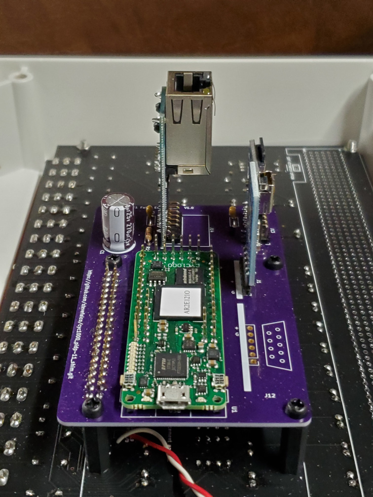
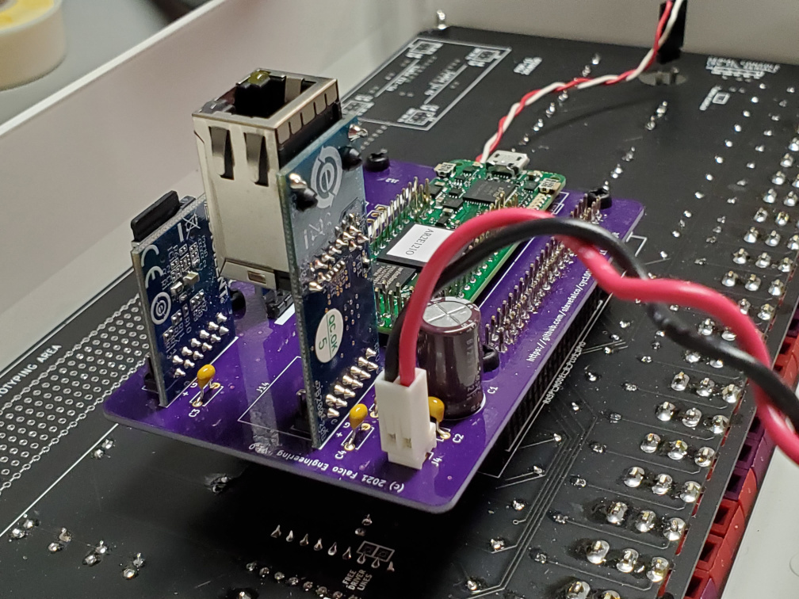
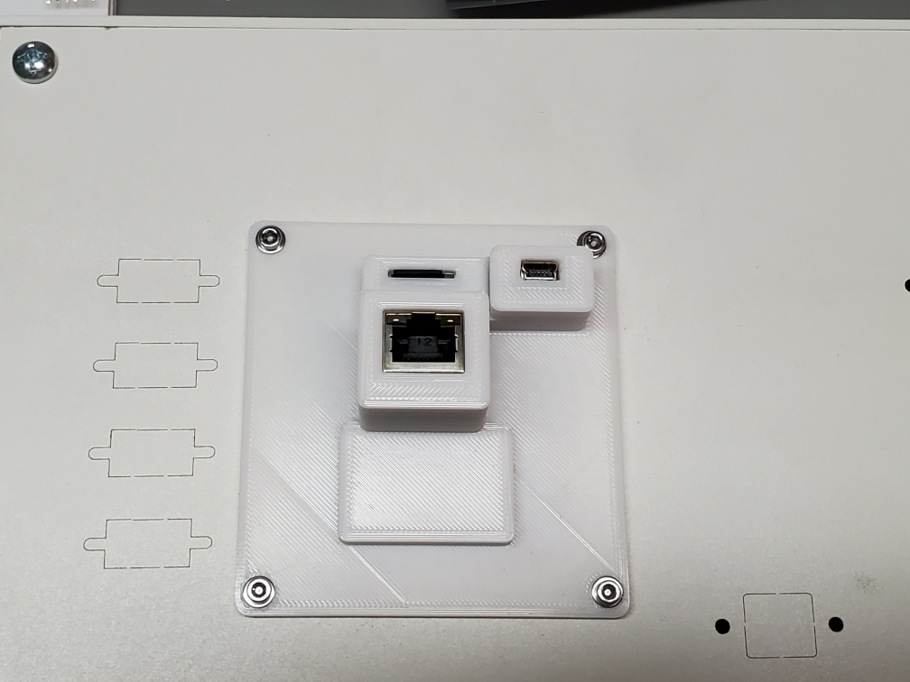
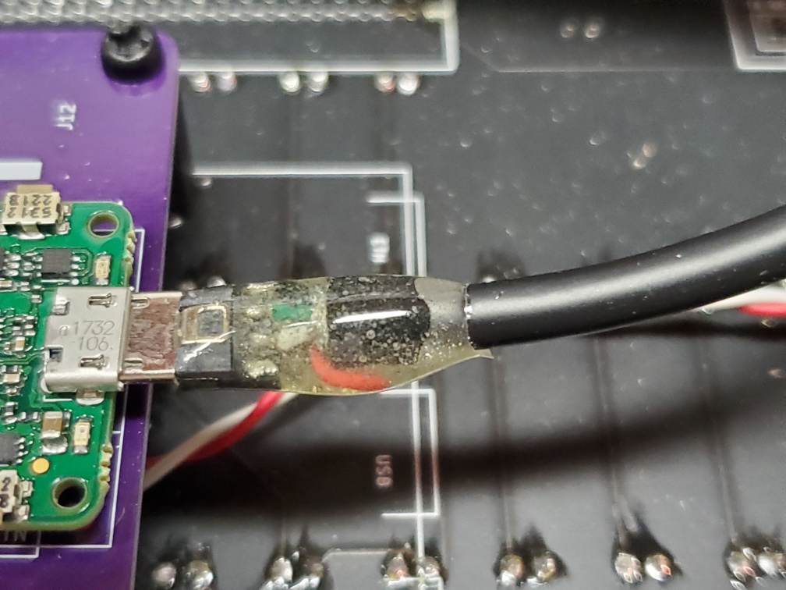

# cyc1000 pidp-11 shim
This shim allows a PDP-2011 CYC1000 FPGA implementation of the PDP-11 to be used with a PiDP-11 panel.

The PDP2011 FPGA is described here:  https://pdp2011.sytse.net/wordpress/pdp-11/fpga-boards/cyc1000/

The PiDP-11 is described here:  https://obsolescence.wixsite.com/obsolescence/pidp-11

This shim PCB is viewed from the top.  It directly plugs onto the back of the PiDP-11 PCB.  I designed this shim because I had electrical noise problems that caused Ethernet glitches.  I traced the problem to the cables between the CYC1000 and the Digilent Ethernet and SD modules.  This shim eliminates the cables and allows the Digilent modules to connect directly to the shim PCB.

Here are two views of the assembled PCB, showing the Digilent modules extending vertically from the PCB.

J11 must be installed on the bottom of this PCB in order to properly mate with the PiDP-11.  The CYC1000 and all other parts are installed on the top of this PCB.

All capacitors are optional.  I personally prefer to include them.  For C1, the square pad is the positive terminal and the round pad is the negative terminal.

R1 is optional, but according to the Microchip data sheet for the ENC424J600 (see figure 2-9) it really should be installed.

You can only install J1 (FTDI-Friend) or J12 (RS232 PMOD), not both, to avoid conflicts driving the RX1 signal.  In the photos above I installed the FTDI-Friend.

I also designed a housing, suitable for 3D printing, to fit over the modules, since they are of different heights, and they extend through the back panel of the PiDP-11.  The housing assumes that you will be using an FTDI Friend rather than an RS232 PMOD.  I removed the female connector from the FTDI Friend, and added a right-angle header, so it could directly solder into the shim.  You will have to modify the housing if you do anything different.  You will find the FreeCAD design file and STL in the housing directory.  Here is a photo:

A few last details.  I am using an external power supply rather than powering the unit over USB.  While the CYC1000 allows simultaneous USB and external power - it automatically chooses the higher voltage - I didn't want that, so I modified a bulkhead cable by grinding off the rubber shell at the male end, then cutting the red (+5 volt) connection, and applying epoxy for mechanical strength.  Here is a photo of the modified cable:

And finally, this shim connects the FPGA reset signal to the Pi connector on GPIO19, which has a convenient trace on the PiDP-11 PCB.  In the photos you can see a red/white pair of wires; these connect from GPIO19 to the Key Switch of the front panel.  Thus, the Key Switch can be used to hard-reset the FPGA.
